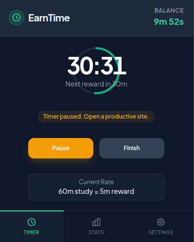
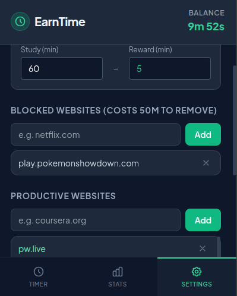
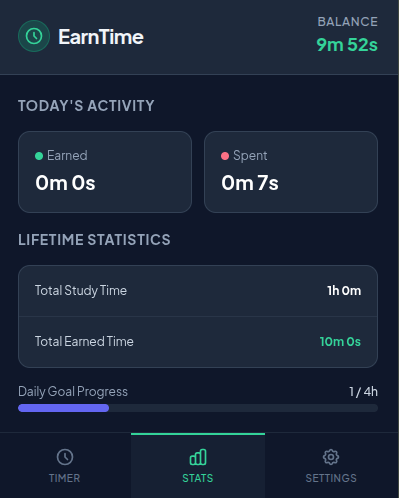

# EarnTime ⏳

> Earn your screen time by studying.

EarnTime is a free Chrome extension that rewards productive study sessions with entertainment time.

Instead of endlessly browsing, you study first and earn minutes that you can later spend on distracting websites.

---

## ✨ Features

- 📚 Earn screen time by studying
- 🚫 Blocks distracting websites until you earn time
- ⏱ Custom study-to-reward ratio
- 💾 Saves your progress locally
- ⚡ Lightweight and fast
- 🔒 No login required
- 🆓 Completely free

---

## 📥 Installation

Since this extension is not available on the Chrome Web Store, install it manually.

1. Download this repository as a ZIP.
2. Extract the ZIP.
3. Open Chrome and go to:

```
chrome://extensions
```

## Screenshots

### Dashboard


### Productivity Status


### Settings


### Statistics


---


## 🛠 Technologies

- JavaScript
- HTML
- CSS

---

## 🤝 Contributing

Suggestions, bug reports, and pull requests are welcome.

---

## ⭐ Support

If you find EarnTime useful, please consider giving this repository a ⭐.

It helps more people discover the project.

---

## 📄 License

See `LICENSES.txt`.
