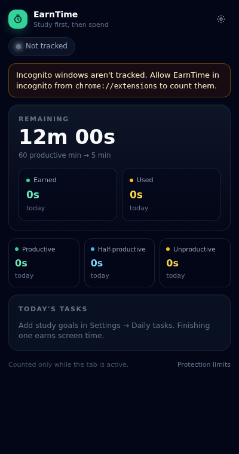
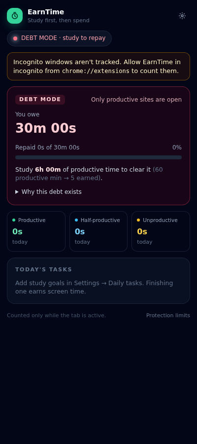
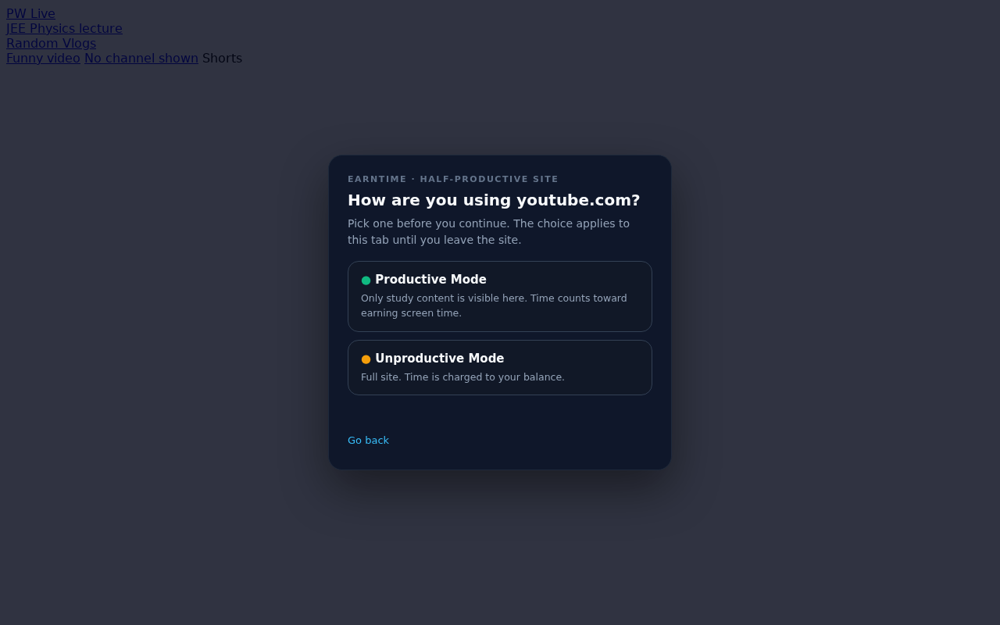
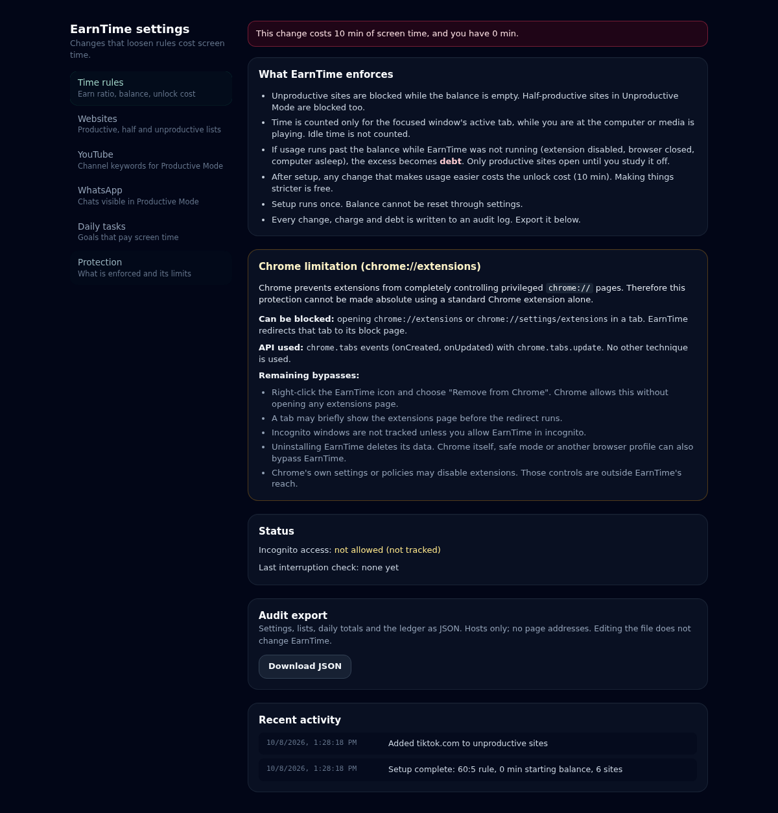

# EarnTime ⏳

> Study to earn your screen time.

EarnTime is a Chrome extension (Manifest V3) that turns study time into screen time. You study on productive sites and earn minutes. You spend those minutes on the sites you choose. If you overspend, you are in debt, and only productive sites open until you study the debt off.

By default **60 productive minutes earn 5 minutes**. The ratio, starting balance, site lists, YouTube keywords, WhatsApp chats and daily tasks are all configurable during a one-time setup.

> **Honest scope.** EarnTime is a self-discipline tool. It cannot make itself unbypassable inside Chrome. Chrome does not allow an extension to fully control `chrome://` pages, and other limits are listed in [`docs/KNOWN_LIMITATIONS.md`](docs/KNOWN_LIMITATIONS.md). Read that file before relying on it.

---

## Screenshots

| Dashboard | Debt mode |
| --- | --- |
|  |  |

| Half-productive mode chooser | Protection settings |
| --- | --- |
|  |  |

*Screenshots were produced by the browser test suite (fixture pages stand in for YouTube).*

---

## What it does

- **Earn-to-use model.** Productive time earns screen time at your ratio. Unproductive time spends it.
- **Three categories.** Productive (earns), half-productive (you choose the mode on each visit; YouTube and WhatsApp Web are included by default) and unproductive (spends).
- **Counts only active use.** Only the active tab of the focused Chrome window counts. Background tabs, minimised windows, idle time and locked screens do not.
- **Debt.** If usage runs past your balance while EarnTime was not running (extension disabled, browser closed, computer asleep), the excess becomes debt, estimated from browser history. Debt restricts browsing to productive sites until it is repaid by studying.
- **YouTube Productive Mode.** Blank homepage with study search. Results and videos show only when the channel name contains one of your keywords. Unreadable channel names are hidden.
- **WhatsApp Web Productive Mode.** Only the chats you list are shown, matched by exact name. If the layout cannot be read, the chat list is hidden.
- **Protection costs.** After setup, changes that make usage easier cost an unlock cost (default 10 min). Tightening is free. Setup runs once.
- **Daily tasks.** Recurring or one-off tasks that pay screen time, once per day or once ever.
- **Audit log.** Every credit, charge, debt, rule change and interruption is recorded. Export it as read-only JSON (hosts only, never page addresses).
- **Local only.** No account, no network calls, no analytics. Data stays in `chrome.storage.local`.

For day-to-day use, see the [user guide](docs/USER_GUIDE.md).

---

## Install

### From the release ZIP or from source

1. Download `EarnTime-<version>.zip` from the [latest release](https://github.com/Yash-4941692/EarnTime/releases/latest) (or download this repository) and extract it. The ZIP unpacks flat: `manifest.json` sits at the top level of the extracted folder.
2. Open `chrome://extensions` and enable **Developer mode**.
3. Click **Load unpacked** and select the extracted folder (the one containing `manifest.json`).
4. The setup wizard opens on first run.

Version 2 replaces the earlier EarnTime release. Settings and balances are migrated automatically on first start. The earlier nuclear mode, focus timer, streaks and factory reset are removed. Legacy storage (including the plaintext password from nuclear mode) is deleted during migration.

---

## Development

The extension source lives in [`source/`](source/). Built files are written to the repository root, where the manifest loads them.

```bash
cd source
npm install
npm run build          # esbuild → ../background.js, ../content.js, ../popup.*, ../settings.*, ../setup.*, ../block.*
npm run typecheck      # tsc --strict over src/ and test/
npm run test:unit      # pure logic: time accounting, reconciliation, rules, costs, migration, invariants
npm run test:sim       # 28 flow tests against a simulated browser (real controller, real chrome adapter)
npm test               # typecheck + unit + simulated-browser flow tests (no browser binary needed)
CHROME_PATH=/path/to/chromium npm run test:browser   # built pages and content scripts in headless Chromium
CHROME_PATH=/path/to/chromium npm run test:all       # everything
npm run package        # release ZIP: refuses a dirty tree, rebuilds, writes outputs/EarnTime-<version>.zip and prints its sha256
```

`npm run package` writes to `/home/user/outputs` by default; pass `-- --out-dir <dir>` to choose somewhere else, or `-- --root <checkout>` to package a different clone. It fails unless the working tree is clean before *and* after the build, so a ZIP always matches exactly one commit, and it re-reads the archive to check every entry against the committed file.

The browser tests need a Chromium binary. They do not load the extension into Chrome; they run the built pages with an in-page harness. See [`docs/TESTING.md`](docs/TESTING.md) for the test report and the manual checklist that still needs a real Chrome.

### Layout

```
manifest.json              MV3 manifest (permissions: storage, tabs, alarms, idle, history, notifications, declarativeNetRequest)
background.js              service worker (built)
content.js                 content script for half-productive pages (built)
popup.* settings.* setup.* block.*   extension pages (built; *.html copied from source/pages)
source/src/core/           pure logic: accounting, reconciliation, rules, costs, tasks, migration, view models
source/src/background/     service worker: controller (serial job queue), Chrome adapter, event wiring
source/src/content/        content scripts: mode chooser, YouTube and WhatsApp filters, overlays
source/src/ui/             React pages (popup, settings, setup, block) and shared components
source/test/               unit tests, simulated-browser flow tests, browser tests and fixtures
docs/                      user guide, testing report, known limitations
```

---

## Privacy

- Data is stored only in your browser's extension storage.
- The `history` permission is used once per interruption, to estimate time from visits. EarnTime keeps hostnames and minutes, not page addresses or titles.
- No network requests are made by the extension.

## Contributing

Suggestions, bug reports and pull requests are welcome. Please run `npm test` in `source/` and, for UI or content-script changes, `CHROME_PATH=... npm run test:all` before opening a pull request.

## License

See [`LICENSES.txt`](LICENSES.txt) and [`LICENSE`](LICENSE).
